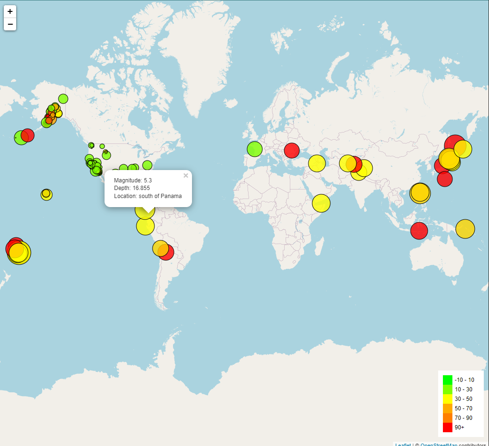

# leaflet-challenge

In this challenge, an earthquake visualization was created using a dataset obtained from [USGS Earthquake Data](https://earthquake.usgs.gov/earthquakes/feed/v1.0/geojson.php). The dataset includes information about all earthquakes that occurred within the past 7 days. Implementation of this was completed using Leaflet.

-The earthquakes are represented on the map using data markers that reflect their magnitude, depth, and location.

-Larger markers indicate higher magnitudes, providing a visual representation of the earthquake's intensity.

-A legend is included to illustrate the depth range of the earthquakes.

Final Results are shown below:

